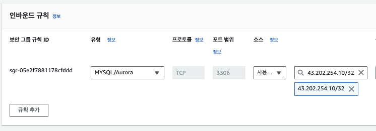
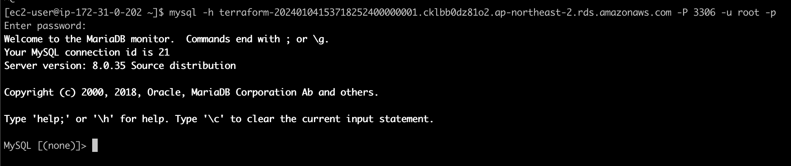
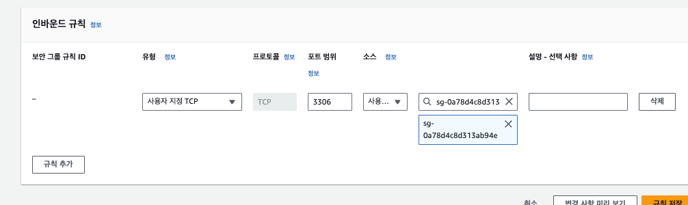
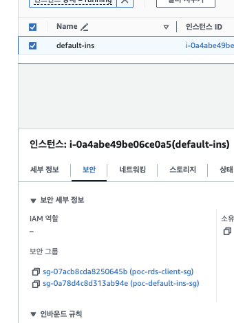
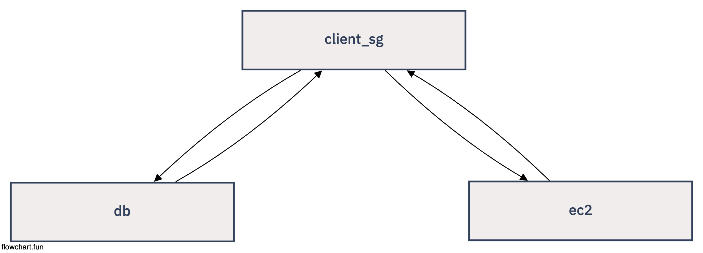

# SG-Best-Architecture (SG를 Proxy 형태로 사용하기)

## EC2에 mysql 설치

```sh
    ## Install mysql
    sudo yum install mysql -y 

    ## mysql connect
    mysql -h [host] -P [port] -u [name]
```

## EC2를 RDS에 연결하는 방법 (SG에 직접 eip 매핑)




## EC2를 RDS에 연결하는 방법 (RDS SG에 Instance SG ID에 매핑)




## EC2에 RDS에 SG를 Proxy로 연결하기 ** (tf 파일)

- EC2에는 최대 5개의 보안그룹을 적용할 수 있음
- rds-client-sg를 Proxy 형태로 사용함으로 써, 실제 RDS에 SG를 깔끔사용 할 수 있음





